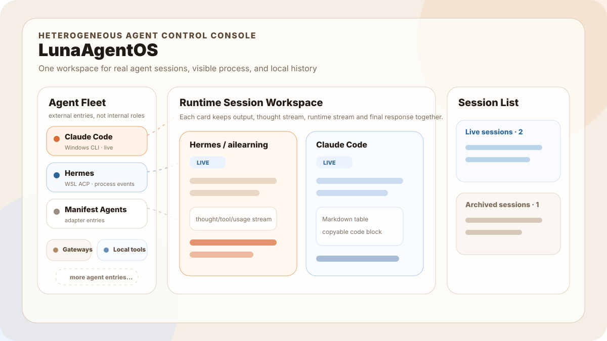

<p align="center">
  
</p>

<h1 align="center">LunaAgentOS</h1>

<p align="center">
  <a href="./README.zh-CN.md">中文说明</a>
</p>

**LunaAgentOS 0.1 Preview**

LunaAgentOS is a neutral desktop workspace for real AI agent sessions.

Today it is a Windows-first app for Claude Code and Hermes: choose a runtime entry, send work into a real session, watch output, thought, and runtime events as they arrive, and keep local session history in one place.

Protocol, adapters, and the Runtime Session Model are the supporting structure behind that workspace. They help LunaAgentOS connect real external runtimes without claiming to replace them.



## Why it exists

AI agents are getting stronger, but the workspace around their real sessions is still fragmented:

- Different products expose different surfaces: CLI, TUI, IDE, gateway, and SDK.
- Process visibility is inconsistent: some runtimes stream thought, tool, plan, or usage events, while others only show a final answer.
- Session history is scattered across tools and hard to restore, compare, or review.

LunaAgentOS focuses on the desktop workspace around those sessions. It treats each external agent product as a runtime entry and makes the Runtime Session Card the shared surface for output, thought, runtime events, final response, and local history.

## What you can do today

| Area | Status | Notes |
|---|---:|---|
| LunaAgentOS App | Working | Tauri 2 desktop app with Rust core and web workspace |
| Claude Code | Working | Real runtime entry |
| Hermes | Working | Windows / WSL ACP runtime instances and profiles |
| Trae IDE | Bridge path | IDE-first adapter direction |
| Runtime Session Cards | Working | Output, thought, runtime, and final response in one surface |
| Multi-session workspace | Working | Current send target, live sessions, archived sessions |
| Local history | Working | JSON session history with restore and read-only states |
| Demo mode | Working | Non-persistent launch scene for orientation and screenshots |
| UI language | Working | zh-CN / en-US switch persisted locally |

## Quick start

### Requirements

- Windows
- Node.js
- Rust with the MSVC toolchain
- Tauri 2 dependencies
- Claude Code installed if you want the Claude entry
- WSL and Hermes installed if you want the Hermes entry

Claude Code and Hermes are optional external runtimes. LunaAgentOS can open without them; unavailable entries remain visible with a clear configuration state.

### Run the app

```powershell
cd apps/desktop-shell
npm install
npm run tauri -- dev
```

### Build a lightweight executable

```powershell
cd apps/desktop-shell
npm run tauri -- build --no-bundle
```

Executable path:

```text
apps/desktop-shell/src-tauri/target/release/desktop-shell.exe
```

More detail: [Getting Started](./docs/getting-started.md)

## Product boundary

LunaAgentOS 0.1 Preview is:

- A neutral desktop workspace for real AI agent sessions
- A Windows-first local app for Claude Code and Hermes sessions
- A Runtime Session workspace centered on durable session cards
- A product surface backed by protocol, adapters, and the Runtime Session Model

LunaAgentOS 0.1 Preview is not:

- A replacement for AionUi, Claude Code, or Hermes
- A complete multi-agent orchestration platform
- A claim that every agent must look the same internally
- A marketplace or broad commercial platform today

## Documentation

### Start here

- [Docs index](./docs/README.md)
- [0.1 Preview Release Notes](./docs/release-notes-0.1-preview.md)
- [Getting Started](./docs/getting-started.md)
- [Current Product Boundary](./docs/current-boundary.md)
- [Contributing](./CONTRIBUTING.md)

### Product and concepts

- [Product Definition](./docs/product-definition.md)
- [Why LunaAgentOS](./docs/why-lunaagentos.md)
- [Light-Core Principles](./docs/light-core-principles.md)
- [Roadmap](./docs/roadmap.md)

### Architecture and integration

- [Architecture Overview](./docs/architecture-overview.md)
- [Hermes ACP Runtime](./docs/hermes-acp-profile-runtime.md)
- [Hermes TUI Direction](./docs/hermes-tui-direction.md)
- [Protocol](./protocol/README.md)
- [Adapters](./adapters/README.md)
- [Core](./core/README.md)
- [Apps](./apps/README.md)
- [Trae IDE Bridge](./bridges/trae-ide/README.md)

### Community and policies

- [Security Policy](./SECURITY.md)
- [Trademark and Brand Guidelines](./TRADEMARKS.md)

### Chinese entry

- [Chinese README](./README.zh-CN.md)
- [Chinese docs index](./docs/README.zh-CN.md)

## License

This project is licensed under [Apache-2.0](./LICENSE).

## Contributing

The highest-value contributions right now are:

- Runtime hardening for Claude Code and Hermes
- Runtime Session Card usability and readability
- Hermes thought, tool, plan, and usage event UX
- Local history, restore, and error-state validation
- Trae IDE bridge design and integration
- Documentation, screenshots, and release polish

Read [CONTRIBUTING.md](./CONTRIBUTING.md) before starting.
