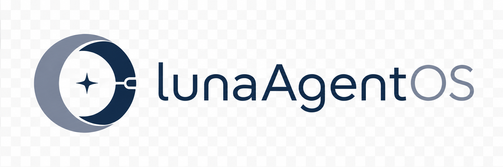
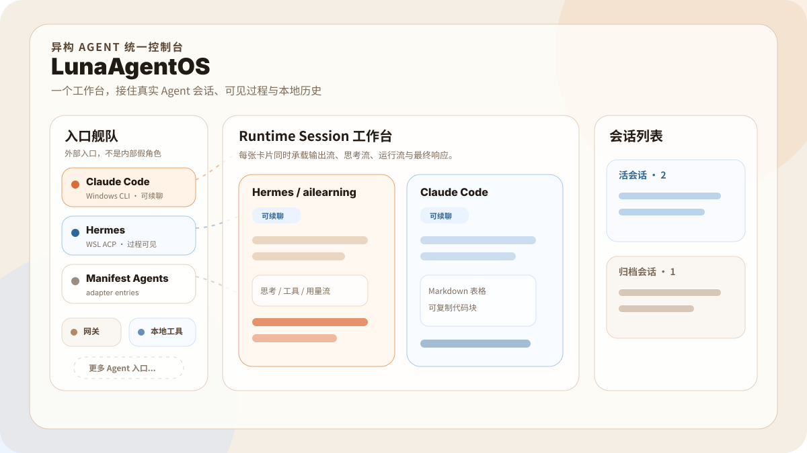

<p align="center">
  
</p>

<h1 align="center">LunaAgentOS</h1>

<p align="center">
  <a href="./README.md">English</a>
</p>

LunaAgentOS 把真实的 Coding Agent runtime 放进同一个桌面工作台。

当前它是一个 Windows 优先的应用，已经接入 Claude Code 和 Hermes：你可以选择目标，把任务发给真实 runtime，实时观察 thought 和 runtime 事件，并把本地会话历史留在一个地方。



## 为什么做

Agent 会越来越强，但它们周围的工作空间仍然很割裂：

- 不同产品暴露不同入口：CLI、TUI、IDE、gateway、SDK 会长期共存。
- 过程可见性不一致：有的 runtime 能持续流出 thought、tool、plan、usage，有的只有最终响应。
- 会话历史分散在不同工具里，很难统一恢复、对比和复盘。

LunaAgentOS 关注的是这些 runtime 之上的控制层。它把每个外部 Agent 视为 runtime entry，把 session card 做成统一承载输出、思考流、运行流、最终响应和本地历史的共享界面。

## 当前能做什么

| 模块 | 状态 | 说明 |
|---|---:|---|
| LunaAgentOS App | 已可用 | Tauri 2 桌面应用，Rust Core + Web 工作台 |
| Claude Code | 已接入 | 真实 runtime 入口 |
| Hermes | 已接入 | Windows / WSL ACP runtime instance 与 profile |
| Trae IDE | Bridge 路线 | IDE-first adapter 方向 |
| Runtime Session Card | 已可用 | 输出流、思考流、运行流、最终响应同屏展示 |
| 多会话工作台 | 已可用 | 当前发送目标、活会话、归档会话 |
| 本地历史 | 已可用 | JSON 历史、恢复、只读归档 |
| 演示模式 | 已可用 | 非持久化演示场景，适合理解产品和截图 |
| 界面语言 | 已可用 | zh-CN / en-US 本地持久化切换 |

## 快速开始

### 环境要求

- Windows
- Node.js
- Rust + MSVC 编译链
- Tauri 2 相关依赖
- 如需 Claude 入口：本机可用的 Claude Code
- 如需 Hermes 入口：WSL + Hermes

Claude Code 和 Hermes 都是可选的外部 runtime。就算没有安装，LunaAgentOS 也可以启动，只是对应入口会显示为未配置或不可用。

### 运行应用

```powershell
cd apps/desktop-shell
npm install
npm run tauri -- dev
```

### 构建轻量可执行文件

```powershell
cd apps/desktop-shell
npm run tauri -- build --no-bundle
```

可执行文件路径：

```text
apps/desktop-shell/src-tauri/target/release/desktop-shell.exe
```

更详细的说明见：[docs/getting-started.zh-CN.md](./docs/getting-started.zh-CN.md)

## 产品边界

LunaAgentOS 当前是：

- 现有 Agent runtime 之上的控制层
- 面向异构入口的 runtime adapter / plugin contract
- 以 Runtime Session Card 为中心的工作台
- 用于观测、路由、恢复真实 session 的本地优先应用

LunaAgentOS 当前不是：

- Claude Code 或 Hermes 的替代品
- 要把所有 Agent 内部机制强行做成一样
- 现在就去做插件市场或商业平台

## 文档入口

### 先看这些

- [文档总览](./docs/README_CN.md)
- [快速开始](./docs/getting-started.zh-CN.md)
- [当前产品边界](./docs/current-boundary.zh-CN.md)
- [贡献指南](./CONTRIBUTING.md)

### 产品与架构

- [产品定义（中文）](./docs/product-definition.zh-CN.md)
- [为什么做 LunaAgentOS（中文）](./docs/why-lunaagentos.zh-CN.md)
- [轻核心原则（中文）](./docs/light-core-principles.zh-CN.md)
- [Architecture Overview](./docs/architecture-overview.md)
- [Roadmap](./docs/roadmap.md)
- [Protocol](./protocol/README.md)
- [Adapters](./adapters/README.md)
- [Apps](./apps/README.md)
- [Hermes ACP Runtime](./docs/hermes-acp-profile-runtime.md)
- [Trae IDE Bridge](./bridges/trae-ide/README.md)

### 英文入口

- [English README](./README.md)
- [English docs index](./docs/README.md)

## 许可证

本项目采用 [Apache-2.0](./LICENSE) 许可证。

## 贡献

当前最有价值的贡献方向：

- Claude Code / Hermes runtime 稳定性
- Runtime Session Card 的可用性和可读性
- Hermes thought / tool / plan / usage 事件体验
- 本地历史、恢复和错误态验证
- Trae IDE bridge 设计与接入
- 文档、截图和发布材料

开始前先看：[CONTRIBUTING.md](./CONTRIBUTING.md)
