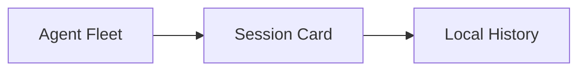

# LunaAgentOS GitHub Release Checklist

首发前按这份清单确认桌面工作台、运行时配置、演示模式、本地历史和 Markdown 输出都处于可解释、可复现状态。

## Runtime configuration

- Claude Code can use the default ACP adapter command, or a user override from the runtime config.
- Hermes can run through the default WSL mode, or a user override using `hermesHost` / `hermesCommand`.
- The left-side `维护` action can read and save the local runtime config.
- Missing runtime errors should point the user toward configuration instead of looking like a crash.

## Demo mode

- Enter demo mode from the topbar.
- Confirm two demo session cards appear: Claude Code and Hermes.
- Confirm the send button is disabled while demo mode is active.
- Exit demo mode.
- Confirm demo sessions are removed from the workspace.
- Confirm `hermes-demo-ailearning` is removed from the left-side fleet.
- Confirm demo history is not written into real local history files.

## Session history storage

- New live session turns are written under `history/live/`.
- Archived or non-live entries are written under `history/archive/`.
- Existing legacy `history/*.json` files are still readable.
- Compact and delete operations scan legacy, live, and archive locations.
- The right-side session list still separates live sessions and archived sessions.

## Two-card workspace layout

- With exactly two real sessions, the workspace uses the two-card layout without requiring demo mode.
- The current receiver card remains visually clear.
- Fullscreen, copy, latest-only, and flow expand/collapse controls still work.

## Markdown smoke test

Send or load output containing:

```markdown
| Item | Status |
|---|---|
| Table | OK |


```

Expected result:

- Markdown table renders as a scrollable table.
- Mermaid is rendered as an in-card SVG diagram, with source fallback and source copy preserved.
- Code copy still works.

## Static and build checks

Run from `desktop-shell/` unless noted otherwise:

```powershell
node --check src/main.js
cargo check --manifest-path src-tauri/Cargo.toml
npm run tauri -- build --no-bundle
git diff --check
```

## Release decision

The repo is ready for a GitHub launch candidate when all checks above pass and the README accurately describes current behavior without presenting internal stage labels as user-facing product promises.
